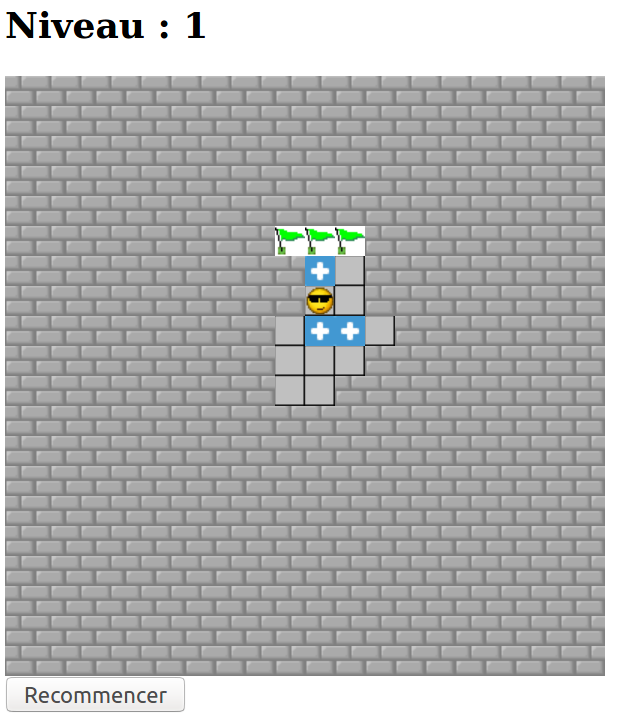
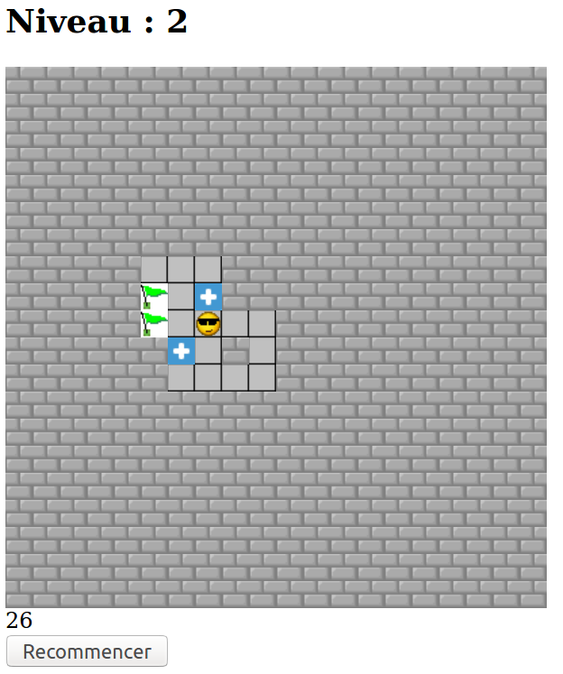

#  Prog web client riche - JavaScript

### IUT Montpellier-Sète – Département Informatique

## TD3 ter
#### _Thème : objets, classes, événements, jeu sokoban_

Cliquez sur le lien ci-dessous pour faire, dans un dossier public_html/JS/TD3ter, votre fork privé du TD3ter (**attention, pas de fork à la main !**):

https://classroom.github.com/a/gzyf-wCj

## INTRODUCTION

Dans ce TD, nous allons réinvestir le travail des trois premiers TD pour créer une version web du jeu sokoban.

Dans ce jeu, un personnage doit pousser des caisses pour les placer sur les emplacements marqués d'un drapeau. Attention, le personnage ne peut que pousser la caisse devant lui, dans le sens de son déplacement. On peut vite se retrouver bloqué... 

Vous disposez de quelques images dans le dossier `images`. L'image de fond est celle du TD3, bien sûr en cours de jeu elle sera "décorée"... Il y a aussi l'image de brique qui permet de construire ce que vous verrez sur les captures d'écran.

L'environnement html est basique (fichier `sokoban.html`), et vous pouvez l'aménager si vous voulez. Le css n'est même pas prévu, à vous de le créer si vous voulez améliorer le visuel. 

Ce TD3ter a fait l'objet d'un projet des années précédentes, avec ces ressources images et ce fichier html.

## CONSIGNES

Le travail à accomplir : créer les fichiers JavaScript qui permettent de jouer, et pourquoi pas améliorer le html et le css (inexistant). 

On peut donner une version strictement fonctionnelle du jeu. On peut aussi organiser le code en classes. A vous de voir. 

## QUELQUES CAPTURES D'ECRAN

**Pour cette partie, le chargé de TD commentera les différentes captures d'écran, au besoin par une démonstration en direct des différentes fonctionnalités.**

### exemple de niveau 1

Voici le jeu à un niveau 1 configuré par le programmeur

   

### exemple de niveau 2

Voici le jeu à un niveau 1 configuré par le programmeur

   

Chaque niveau est bien sûr conçu par le codeur, on peut en prévoir autant qu'on veut.

**A VOUS !!!**